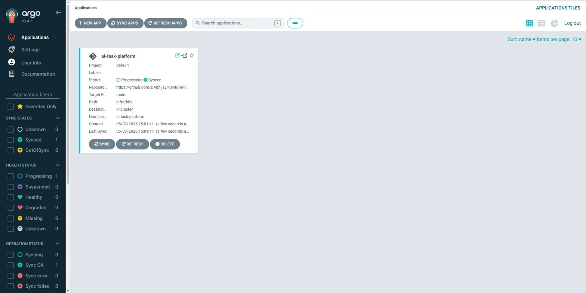

# AI Task Processing Platform

MERN + Python asynchronous task processing platform with Docker, Kubernetes, Argo CD, and CI/CD.

## Structure
- frontend/
- backend/
- worker/
- infra/
- docker-compose.yml

## Run locally
1. Copy env examples to .env files in each service.
2. Run `docker compose up --build`.
3. Frontend: http://localhost:5173
4. Backend health: http://localhost:4000/api/health

## API endpoints
- POST /api/auth/register
- POST /api/auth/login
- POST /api/tasks
- GET /api/tasks
- GET /api/tasks/:id
- PATCH /api/tasks/:id/status

## Kubernetes + Argo CD
- Apply manifests under infra/k8s.
- Configure and apply infra/argocd/application.yaml.

## Argo CD Dashboard

> Note: Infrastructure manifests are located in the `/infra` directory of this repository.
> In a production setup this would be a separate repository for GitOps separation of concerns.